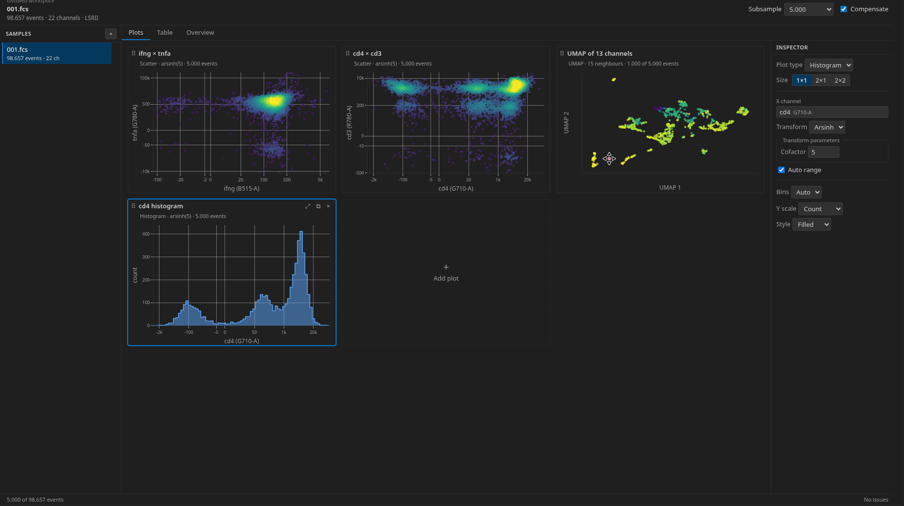

# vscode-fcs-viewer

> Inspect flow cytometry data from FCS files in VS Code.

> This extension was almost exclusively vibe-coded with `claude-code`.
> I don't guarantee for its correctness, but its fun to play around with.

## Features

- **FCS Parser:** Open and inspect FCS files.
- **Plot Cards:** Interactive Scatter Plots, Contour Plots, and Histograms cards thanks to `React` and `plotly-js`.
- **Compensation:** Optionally apply the spillover compensation from the files `$SPILLOVER` metadata key.
- **Overview and table:** All metadata, per-channel statistics, the spillover matrix, and a event table.
- **Dimensionality Reduction:** Visualization of high-dimensional cytometry data via UMAP provided by `umap-js`.
- **Save and load workspaces:** Save plot configurations as a workspace and come back to it later.

## Commands

**FCS Viewer** provides 3 commands to manage workspaces:

| Command | Does |
| --- | --- |
| `Open Workspace…` | Pick a saved workspace, or start a new empty one |
| `Save Workspace…` | Name the current workspace's samples and plot cards |
| `Discard Workspace…` | Delete a saved workspace; the FCS files are untouched |

Right-clicking a `.fcs` file adds **Open in FCS Viewer** (always a new
workspace) and, when one is already open, **Add to FCS Viewer Workspace**.

## Settings

| Setting | Default | Meaning |
| --- | --- | --- |
| `fcsViewer.defaultSampleSize` | `5000` | Events plot cards render by default |
| `fcsViewer.defaultCofactor` | `0` | Arsinh cofactor; `0` picks from `$CYT` |
| `fcsViewer.maxFileSizeMB` | `1024` | Prompt before opening larger files |
| `fcsViewer.maxSliceMB` | `16` | Confirm before transferring more than this |

## Limitations

- Gating: Gating is currently not supported.
- Editing: The extension is currently read-only and never writes to your FCS files.
- t-SNE: UMAP was preferred over t-SNE for efficiency.

## Acknowledgements

- Claude, duh
- [Flowkit](https://github.com/whitews/flowkit) by Scott White
- [`umap-js`](https://github.com/pair-code/umap-js) and [`plotly-js`](https://plotly.com/javascript/)
